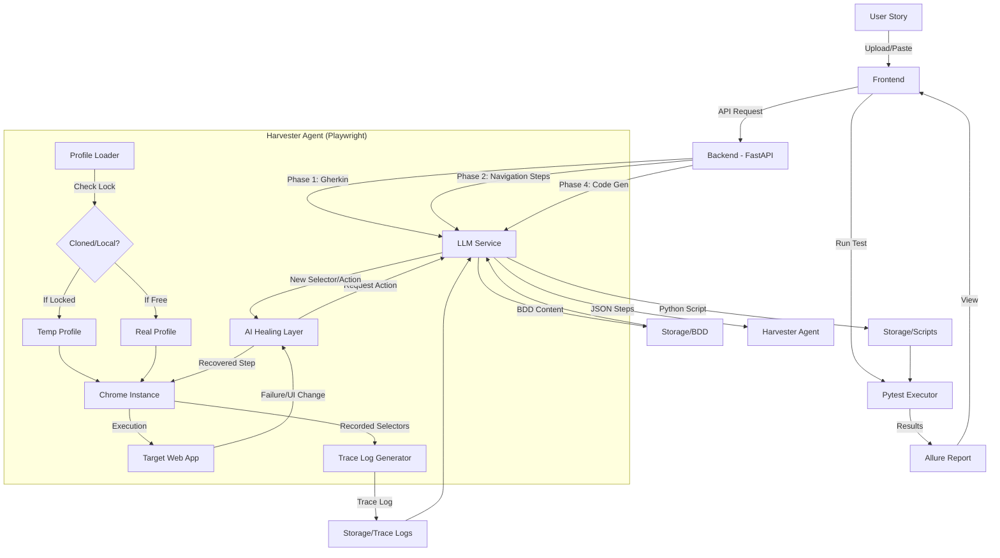

# Architectural Diagram

The following diagram illustrates the flow of data and control within the AI-Powered BDD Automation Framework, including the advanced AI Self-Healing and Chrome Session Persistence features.

## Component Roles

- **Frontend**: User interface for management, configuration (Chrome paths), and viewing healing reports.
- **Backend**: Service orchestration, file management, and FastAPI host.
- **LLM Service**: Intelligent translation of requirements and real-time healing reasoning.
- **Harvester Agent**: Dynamic execution engine with session persistence and AI-driven recovery.
- **AI Healing Layer**: Captures DOM context and coordinates with LLM to resolve navigation blockers.
- **Pytest/Allure**: Standard testing framework and visual reporting tools.
